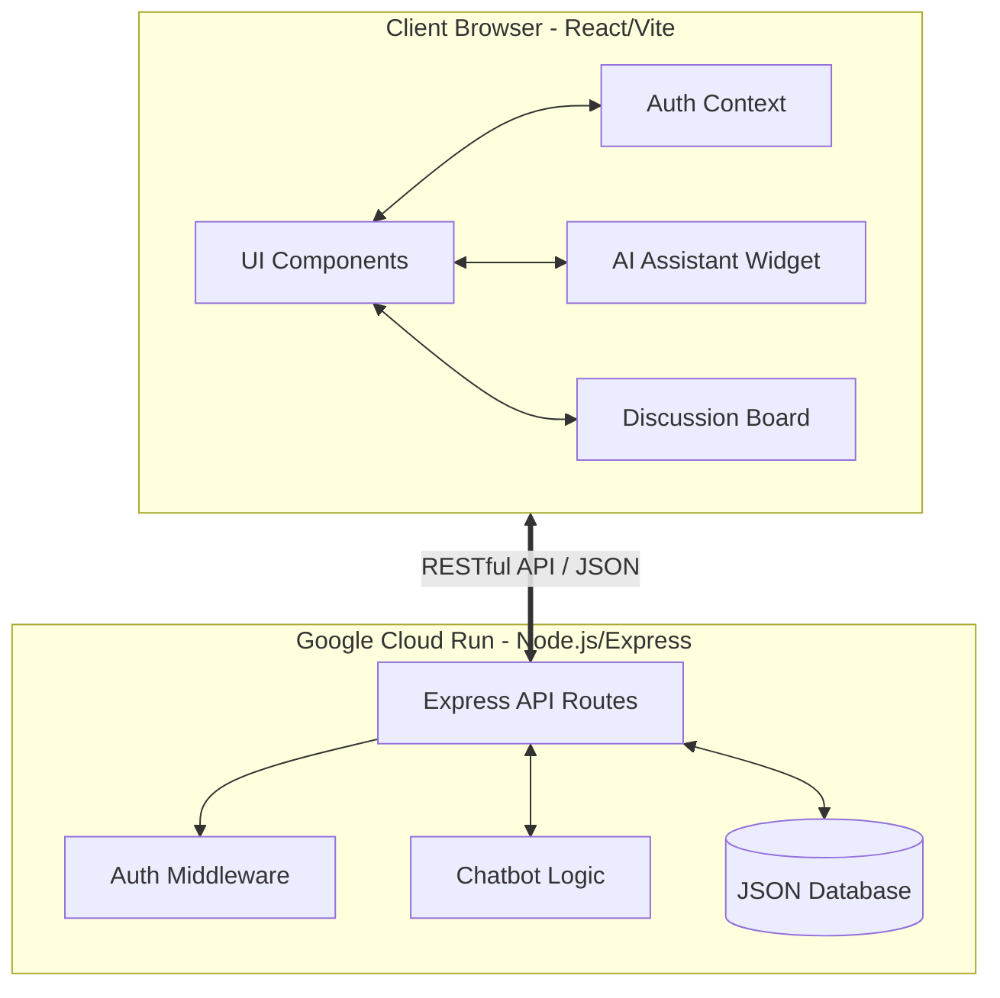
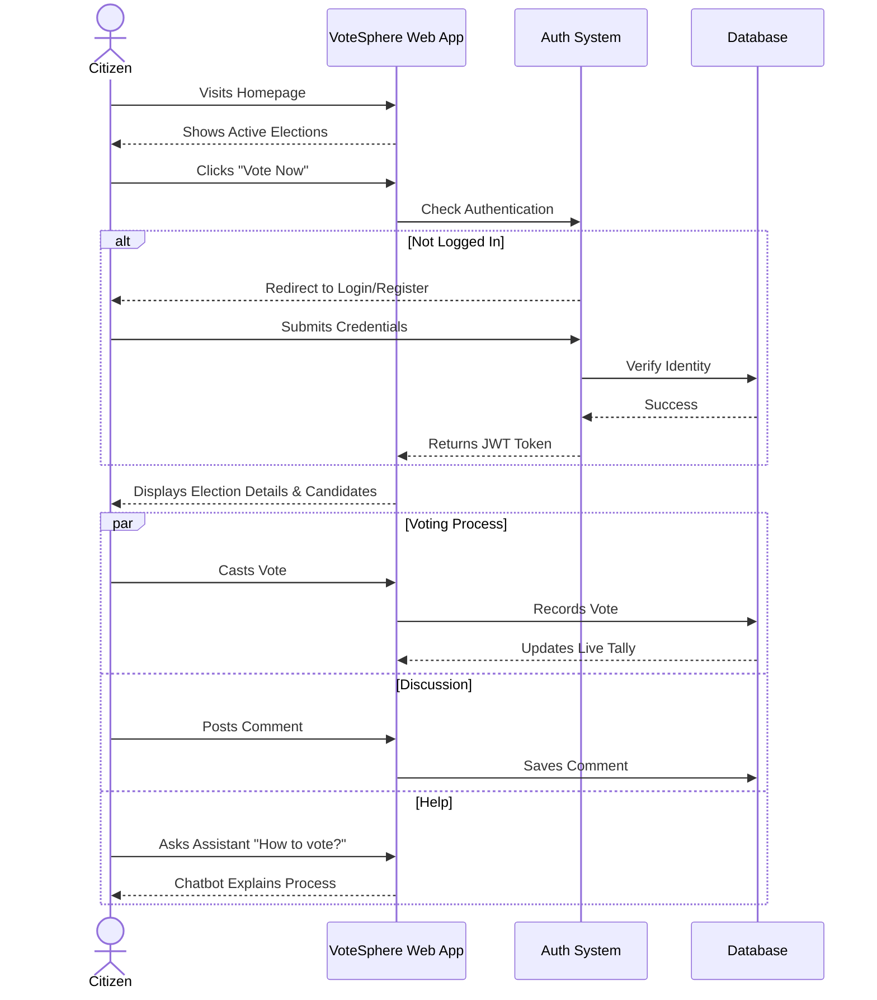

# 🗳️ VoteSphere


**VoteSphere** is a next-generation, interactive democratic participation platform. It simulates a highly secure, real-time voting environment featuring live tallies, community discussions, and an integrated AI assistant to guide voters through the election process.

---

## ✨ Key Features

- **🔒 Military-Grade Simulation**: JWT-based authentication simulating secure Aadhaar-based citizen verification.
- **⚡ Real-Time Tally**: Live leaderboard that updates instantly as votes are cast.
- **💬 Voter Discussion Board**: Authenticated users can discuss and debate on specific election pages in real-time.
- **🤖 Built-in AI Assistant**: A floating, context-aware chatbot that helps voters understand voting procedures, EVMs, and current standings.
- **✨ Glassmorphic UI**: A stunning, modern, and fully responsive interface powered by Framer Motion animations.

---

## 🏗️ System Architecture

VoteSphere uses a decoupled Client-Server architecture. The frontend is a snappy Single Page Application (SPA) built with Vite and React, while the backend is a lightweight Node.js Express API.



---

## 🗺️ User Flow

Understanding how a user navigates VoteSphere:



---

## 🛠️ Technology Stack

| Component | Technology |
| :--- | :--- |
| **Frontend Framework** | React 18, Vite |
| **Styling & Animation** | Custom CSS (Glassmorphism), Framer Motion |
| **Icons** | Lucide React |
| **Backend Server** | Node.js, Express.js |
| **Database** | JSON File System (Simulated DB) |
| **Containerization** | Docker (Multi-stage builds) |
| **Cloud Deployment** | Google Cloud Run, Cloud Build |

---

## 🚀 Getting Started (Local Development)

### Prerequisites
- Node.js (v18+)
- npm or yarn

### Installation

1. **Clone the repository:**
   ```bash
   git clone https://github.com/shaikzz-collab/promptwar2.git
   cd promptwar2
   ```

2. **Install dependencies:**
   ```bash
   npm install
   ```

3. **Start the development server:**
   *(This runs both the React frontend and Express backend concurrently)*
   ```bash
   npm run dev
   ```

4. Open your browser and visit `https://votesphere-418298260067.us-central1.run.app/`

---

## ☁️ Cloud Deployment

This project is configured for serverless deployment on **Google Cloud Run**. 

To deploy the application:
1. Authenticate with Google Cloud: `gcloud auth login`
2. Set your project: `gcloud config set project your-project-id`
3. Run the deployment:
   ```bash
   gcloud run deploy votesphere --source . --region us-central1 --allow-unauthenticated --set-env-vars JWT_SECRET=your_secret_key
   ```

---

## 🧠 PromptWars Challenge: Prompts Used

This application was built as a submission for the **PromptWars Virtual** challenge, demonstrating the power of AI-assisted software engineering. Below are the key prompts used to guide the AI in generating and refining the platform:

> *"Build a modern, interactive election platform with a glassmorphic UI, real-time leaderboard, and secure authentication."*

> *"Add an assistant in the web page and add interaction between users and I want to deploy it in Google Cloud."*

> *"Just add a simple inbuilt assistant [without requiring external API keys]."*

> *"Check all the errors and correct it and move to deploy."*

> *"Fix the styling to use explicit inline styles so it is perfectly responsive and visually flawless."*

> *"Write a Dockerfile and cloudbuild.yaml to deploy this to Google Cloud Run."*

---
*Built with ❤️ for a stronger democracy.*
